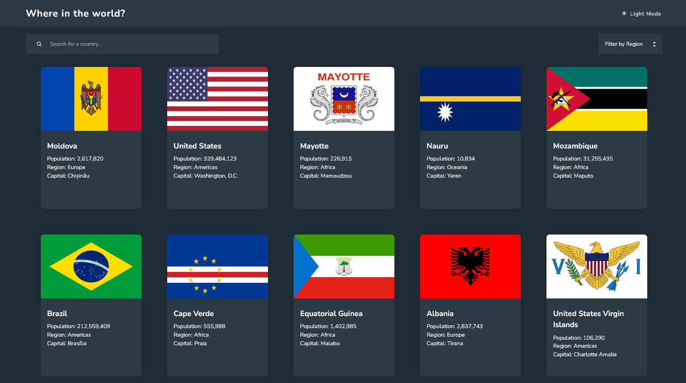
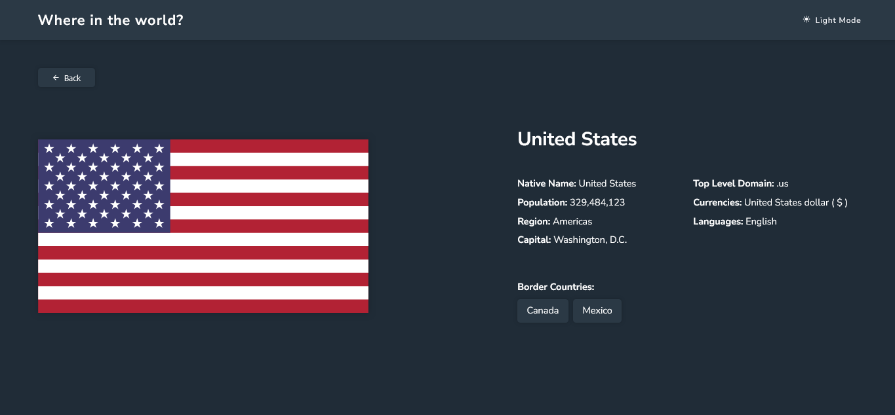
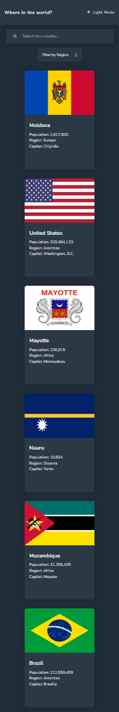
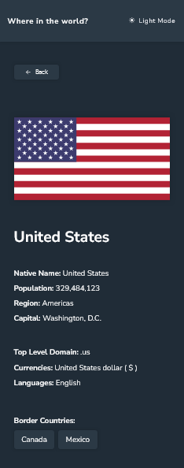

# Frontend Mentor - REST Countries API with color theme switcher solution

This is a solution to the [REST Countries API with color theme switcher challenge on Frontend Mentor](https://www.frontendmentor.io/challenges/rest-countries-api-with-color-theme-switcher-5cacc469fec04111f7b848ca). Frontend Mentor challenges help you improve your coding skills by building realistic projects.

## Table of contents

- [Overview](#overview)
  - [The challenge](#the-challenge)
  - [Screenshot](#screenshot)
  - [Links](#links)
  - [Built with](#built-with)
- [Author](#author)

## Overview

### The challenge

Users should be able to:

- See all countries from the API on the homepage
- Search for a country using an `input` field
- Filter countries by region
- Click on a country to see more detailed information on a separate page
- Click through to the border countries on the detail page
- Toggle the color scheme between light and dark mode _(optional)_

## Built with

<ul>
  <li>HTML</li>
  <li>CSS</li>
  <li>Vite</li>
  <li>React</li>
  <li>TypeScript</li>
</ul>

## Screenshot

### Desktop

#### Home

#### Details

### Mobile

#### Home

  

#### Details

  

## Links

- Solution URL: [GitHub](https://github.com/MiguellPC/rest-countries-api)
- Live Site URL: [GitHub Pages](https://miguellpc.github.io/rest-countries-api/)

## Author

- GitHub - [Miguel Caixeta](https://github.com/MiguellPC)
- Frontend Mentor - [@MiguellPC](https://www.frontendmentor.io/profile/MiguellPC)
- Linkedin - [Miguel Caixeta](https://www.linkedin.com/in/miguel-caixeta-39628a118/)
